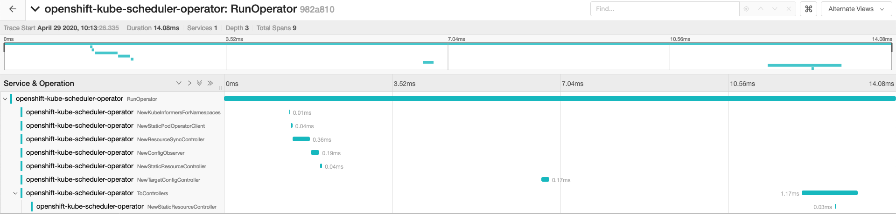

# Running an example setup

The OpenTelemetry Collector is a "middleman" between 1) components that export OpenTelemetry traces and 2)
backend programs which parse traces into a UI.

The benefit of its use is the ability to hot-swap backends without having to recompile any of the traced components
or reconfigure their exporting endpoints. They need to only refer to the service that is configured on the Collector,
and any changes can be applied to the Collector.

So to run an example you need:
1. A tracing backend
2. The OpenTelemetry Collector (this operator)
3. A component that can be configured to export traces

## Jaeger backend installation

The Jaeger UI is a good example backend, and there is already an Operator provided by Red Hat on OperatorHub. To install it:
1. Search "**Jaeger**" on the OperatorHub in your OpenShift Console
2. Install the "**Red Hat OpenShift Jaeger**" operator (double check the namespace you're installing to, recommend creating a new project "jaeger")
3. Once it's installed, click on it and then click "**Create Instance**" to create an instance of the Jaeger UI. Click through using the default values

If you follow the above steps, you should see the following output from `oc`:
```
$ oc get all -n jaeger
NAME                                              READY   STATUS    RESTARTS   AGE
pod/jaeger-all-in-one-inmemory-86dcf8c9b7-prnr2   2/2     Running   0          59m

NAME                                                    TYPE        CLUSTER-IP       EXTERNAL-IP   PORT(S)                                  AGE
service/jaeger-all-in-one-inmemory-agent                ClusterIP   None             <none>        5775/UDP,5778/TCP,6831/UDP,6832/UDP      59m
service/jaeger-all-in-one-inmemory-collector            ClusterIP   172.30.217.8     <none>        9411/TCP,14250/TCP,14267/TCP,14268/TCP   59m
service/jaeger-all-in-one-inmemory-collector-headless   ClusterIP   None             <none>        9411/TCP,14250/TCP,14267/TCP,14268/TCP   59m
service/jaeger-all-in-one-inmemory-query                ClusterIP   172.30.215.229   <none>        443/TCP                                  59m

NAME                                         READY   UP-TO-DATE   AVAILABLE   AGE
deployment.apps/jaeger-all-in-one-inmemory   1/1     1            1           59m

NAME                                                    DESIRED   CURRENT   READY   AGE
replicaset.apps/jaeger-all-in-one-inmemory-86dcf8c9b7   1         1         1       59m

NAME                                                  HOST/PORT                                                                                      PATH   SERVICES                           PORT    TERMINATION   WILDCARD
route.route.openshift.io/jaeger-all-in-one-inmemory   jaeger-all-in-one-inmemory-jaeger.apps.ci-ln-wz0w3tk-d5d6b.origin-ci-int-aws.dev.rhcloud.com          jaeger-all-in-one-inmemory-query   <all>   reencrypt     None
```
The `route` is the url to the Jaeger UI which allows you to search for traces. So in this example, it is `https://jaeger-all-in-one-inmemory-jaeger.apps.ci-ln-wz0w3tk-d5d6b.origin-ci-int-aws.dev.rhcloud.com`.

## OpenTelemetry Collector Installation

To install the OpenTelemetry Collector, simply run `oc create -f manifests/.` from the root of this operator's repo. This will install
everything to the namespace `opentelemetry-operator`.

You will also need to provide a config to the operator to configure the Collector's receivers and exporters (see
the [OpenTelemetry docs](https://opentelemetry.io/docs/collector/configuration/) for more info on these).

An example CR would be like so:
```
apiVersion: operator.openshift.io/v1alpha1
kind: OpenTelemetry
metadata:
  name: collector
  namespace: opentelemetry-operator
spec:
  image: "quay.io/opentelemetry/opentelemetry-collector:v0.2.0"
  service:
    - name: jaeger-grpc
      port: 14250
      targetPort: 14250
  config: |
    receivers:
      jaeger:
        protocols:
          grpc:
    processors:
      queued_retry:
    
    exporters:
      jaeger_grpc:
        endpoint: jaeger-all-in-one-inmemory-collector:14250
    
    service:
      pipelines:
        traces:
          receivers: [jaeger]
          processors: [queued_retry]
          exporters: [jaeger_grpc]
```

**NOTE:** The `endpoint` param under the `jaeger_grpc` exporter refers to the collector service created by the
Jaeger operator in the above step, serving on its default gRPC port.

If your config works correctly, you should see the below in the operator namespace:

```
$ oc get all -n opentelemetry-operator
NAME                                           READY   STATUS    RESTARTS   AGE
pod/opentelemetry-collector-86cbd579c8-h5m9s   1/1     Running   0          51m
pod/opentelemetry-operator-789d7879bc-jdshj    1/1     Running   0          62m

NAME                     TYPE        CLUSTER-IP      EXTERNAL-IP   PORT(S)     AGE
service/otel-collector   ClusterIP   172.30.31.143   <none>        14250/TCP   62m

NAME                                      READY   UP-TO-DATE   AVAILABLE   AGE
deployment.apps/opentelemetry-collector   1/1     1            1           62m
deployment.apps/opentelemetry-operator    1/1     1            1           62m

NAME                                                 DESIRED   CURRENT   READY   AGE
replicaset.apps/opentelemetry-collector-86cbd579c8   1         1         1       51m
replicaset.apps/opentelemetry-operator-789d7879bc    1         1         1       62m
```

## Sample component with OTLP tracing

All of this is useless unless something is actually exporting OTLP (OpenTelemetry Collector)-compatible traces.

For this example, I've re-built the [Kube Scheduler Operator](https://github.com/damemi/cluster-kube-scheduler-operator/tree/otlp-tracing-example)
with some simple spans in its TargetConfigReconciler. (The interesting code changes are in [pkg/operator/starter.go](https://github.com/damemi/cluster-kube-scheduler-operator/commit/96e7f122b1ff9500e9171cb38c12498b6ecbc154#diff-ef02f4dd56d4bd19d7b3e4913b9a57d5)
and [pkg/operator/target_config_reconciler_v410_00.go](https://github.com/damemi/cluster-kube-scheduler-operator/commit/96e7f122b1ff9500e9171cb38c12498b6ecbc154#diff-a4804ecbda2ebac05da3f9471e6aa96e))

To run this yourself, scale down the CVO so you can edit the scheduler operator's image.

Then, you can either build your own image from my fork or use the example `quay.io/mdame/kso-tracing-example`.
Edit the scheduler operator deployment (`oc edit deployment.apps/openshift-kube-scheduler-operator -n openshift-kube-scheduler-operator`)
to include the following in the pod template spec:

```
...
spec:
  containers:
    env:
    - name: OTLP_ENDPOINT
      value: otel-collector.opentelemetry-operator:14250
    ...
    image: quay.io/mdame/kso-tracing-example
    ...
...
```

After editing this you should see a new kube-scheduler-operator pod deploy, and refreshing the Jaeger UI a new
"kube-scheduler-operator" Service available to search traces for:


Clicking on a trace shows a detailed breakdown of each span within it:

